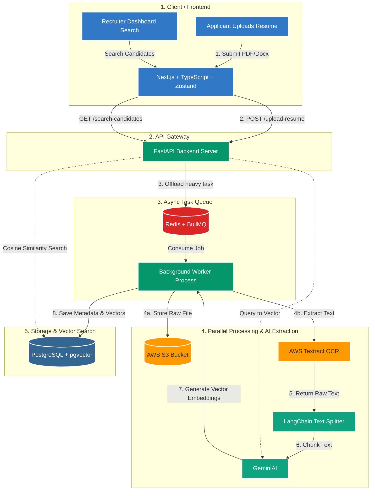

# AI ATS Backend

Production-oriented backend for an AI-powered Applicant Tracking System (ATS), built with asynchronous FastAPI patterns, PostgreSQL persistence, vector-enabled candidate ranking, and AI-assisted resume analysis.

## System Overview

This service handles the core ATS backend responsibilities:

- User authentication and role-based user domain using `fastapi-users`.
- Job posting creation and retrieval.
- Resume upload and applicant record creation.
- Asynchronous applicant processing (AI extraction, analysis, embedding).
- Semantic candidate ranking using weighted cosine similarity.
- Standardized API response envelope and centralized exception handling.

Primary implementation modules:

- `app/main.py`: app bootstrap, router mounting, middleware, global exception handlers.
- `app/routers/`: API route orchestration (`auth`, `user`, `job`, `job_applicant`).
- `app/services/`: business logic for AI, storage, vector ranking, and domain workflows.
- `app/worker/`: asynchronous applicant processing pipeline.
- `app/models/` + `migrations/`: persistence model and schema migration lifecycle.

## Technical Architecture Diagram

The following diagram represents the full platform topology (frontend + backend + processing + storage):



## Runtime Design in This Repository (Current)

- API framework: `FastAPI` with async SQLAlchemy/SQLModel session patterns.
- Data layer: `PostgreSQL` + vector columns for embeddings.
- AI provider: Google Gemini (`gemini-2.5-flash-lite`, `gemini-embedding-001`).
- Storage: AWS S3 for resume binary persistence.
- Background processing: FastAPI `BackgroundTasks` + async worker pipeline in `app/worker/process_job_applicant.py`.
- Retry strategy: exponential backoff and dead-letter lifecycle via `ApplicationStatus` + `retry_count`.
- Response contract: strongly typed `ResponseEnvelope[...]` and global exception normalization.

## Data and Processing Pipeline

1. Applicant submits resume and metadata to `/job-applicants/`.
2. Service validates payload, stores resume in S3, and persists applicant record.
3. Background processor starts and marks application `PROCESSING`.
4. Resume extraction and normalization run through Gemini schema-bound parsing.
5. Parallel tasks execute with `asyncio.gather(...)`:
   - Resume embedding generation.
   - Resume-vs-job AI analysis.
6. Weighted similarity logic combines:
   - Description similarity.
   - Responsibilities similarity.
   - Requirements similarity.
   - AI analysis score adjustment.
7. Final normalized score, analysis details, and vector embeddings are persisted.
8. Recruiters can fetch ranked results through `/job-applicants/vector-search/{job_post_id}`.

## API Surface (High-Level)

- Health: `/`, `/db-test`
- Auth: `/auth/*`
- Users: `/users/*`
- Jobs: `/jobs/*`
- Applicants: `/job-applicants/*`

Detailed endpoint contract documentation is maintained in `docs/api-endpoints.md`.

## Configuration

Environment variables loaded through `app/core/config.py`:

- `DB_URL`
- `SECRET_KEY`
- `GEMINI_API_KEY`
- `AWS_ACCESS_KEY_ID`
- `AWS_SECRET_ACCESS_KEY`
- `AWS_REGION`
- `S3_BUCKET_NAME`
- `MAX_JOB_APPLICANT_RETRIES` (default: `3`)

## Local Development

### 1) Setup Environment

```bash
python -m venv .venv
# Windows
.venv\Scripts\activate
# macOS/Linux
source .venv/bin/activate
```

### 2) Install Dependencies

`requirements.txt` is currently a placeholder and should be fully pinned. Install currently used core packages manually if needed:

```bash
pip install fastapi uvicorn sqlmodel sqlalchemy alembic pydantic pydantic-settings fastapi-users fastapi-users-db-sqlmodel google-genai tenacity boto3 pgvector psycopg
```

### 3) Configure Environment

Create `.env` in project root with the variables listed above.

### 4) Run Database Migrations

```bash
alembic upgrade head
```

### 5) Start API Server

```bash
uvicorn app.main:app --reload
```

## Progress Checklist

### Core Platform

- [x] Async FastAPI backend with modular router/service/model architecture.
- [x] Standardized response envelope and centralized exception handlers.
- [x] Auth and user management integration with `fastapi-users`.
- [x] Job creation and listing endpoints.

### Resume and Applicant Processing

- [x] Resume upload flow with S3 persistence.
- [x] Applicant creation with duplicate protection constraints.
- [x] Background applicant processing pipeline.
- [x] Parallel AI operations for analysis + embedding (`asyncio.gather`).
- [x] Retry policy with exponential backoff and dead-letter transition.

### Ranking and Search

- [x] Vector-based candidate ranking endpoint.
- [x] Weighted similarity scoring using description/responsibilities/requirements.
- [x] Paginated, filterable, and sortable applicant listing.

## Remaining Work and Future Additional Features

### Critical Near-Term

- [ ] Improve and rigorously test job-vs-resume grading quality (known gap).
- [ ] Enforce strict 20/30/50 rubric output contract (`score`, `reasoning`, `missing_skills`) across the full pipeline.
- [ ] Replace ad-hoc dependency install process with a complete pinned `requirements.txt`.
- [ ] Add comprehensive automated tests (`pytest`, async API tests, service tests).

### Queue and Scalability

- [ ] Migrate from in-process `BackgroundTasks` to durable queue workers (`Celery + Redis`) for production reliability.
- [ ] Add idempotency keys and robust duplicate-job prevention for worker tasks.
- [ ] Introduce explicit dead-letter queue replay/inspection tooling.

### AI and Search Enhancements

- [ ] Integrate OCR fallback pipeline (Textract or equivalent) for low-quality/non-parseable PDFs.
- [ ] Upgrade embedding/search to database-native vector operators where beneficial.
- [ ] Add explainable ranking diagnostics per candidate match.

### Security and Reliability

- [ ] Harden CORS allowlist and trusted-host policy for production.
- [ ] Add endpoint rate limiting for auth/upload abuse prevention.
- [ ] Implement production-grade observability (metrics, tracing, error monitoring).
- [ ] Move secrets management to AWS Secrets Manager or SSM.

## MVP Launch Direction

Recommended execution order:

1. Security hardening.
2. Durable worker architecture.
3. AI grading quality and regression testing.
4. Observability and deployment reliability gates.

## Notes

- This backend already contains key ATS primitives and a functional AI enrichment pipeline.
- The largest quality lever before broad rollout is grading consistency and test coverage.
- The largest reliability lever is introducing a durable queue and fully pinned dependencies.
